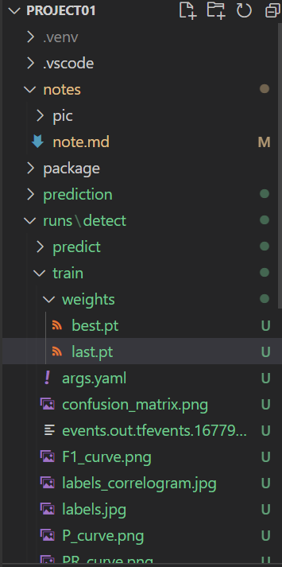
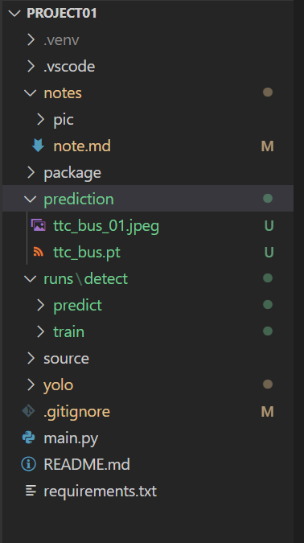
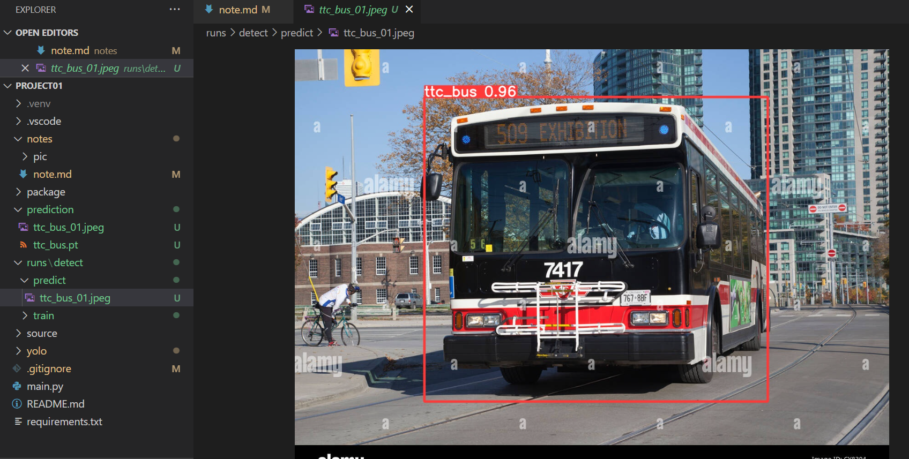

# Tech Note

- [Tech Note](#tech-note)
  - [Step 1: Virtual Environment](#step-1-virtual-environment)
  - [Step 2: download training images](#step-2-download-training-images)
  - [Step 3: label training images](#step-3-label-training-images)
  - [Step 4: Configuration: YOLOv8](#step-4-configuration-yolov8)
  - [Step 5: Predict](#step-5-predict)

---

## Step 1: Virtual Environment

1. Create virtual environment

   `python -m venv .venv`

2. Activate virtual environment

   `.venv\scripts\activate`

3. select Python interpretor

---

## Step 2: download training images

1. update pip

   `pip install --upgrade pip`

2. install `simple_image_download` version: 0.4

   `pip install simple_image_download==0.4`

3. create `image_downloader.py`

```py
from simple_image_download import simple_image_download as simp

# package/image_downloader.py
def down_images(keyword, num_pic):
    response = simp.simple_image_download()

    for kw in keyword:
        response.download(keywords=kw, limit=num_pic)
```

4. update `main.py`

```py
import package.image_downloader as downloader

# /main.py
def main():
    str = "__main__"
    print("\n--------Main--------\n")

    keywords = ["toronto bus"]
    num_pic = 20

    downloader.down_images(keywords, num_pic)


if __name__ == "__main__":
    main()
```

---

## Step 3: label training images

1. install `labelImg` library

   `pip install labelImg`

2. call app `labelImg`

   `labelImg`

   label the picture

---

## Step 4: Configuration: YOLOv8

1. create file structure:

   - yolo
     - train
       - images: copy all labeled images
       - labels: copy all txt files
     - val
       - images: select 10 images
       - labels: copy txt files of the above images

2. install `ultralycts`

   `pip install ultralytics`

3. verification of `ultralycts`

   - cmd: `python`
   - python code

   ```py
   import torch
   torch.__version__ # 1.13.1+cpu
   ```

4. install `pytorch` for GPU

   - website: https://pytorch.org/get-started/locally/
     - Build: Stable
     - OS: Windows
     - Package: pip
     - Language: Python
     - Platform: CUDA
   - get the pip command

5. verification of `pytorch`

   - cmd: `python`
   - python code

   ```py
   import torch
   torch.__version__ # should be CUDA
   torch.cuda.is_available() # true
   ```

6. create configuration `.yaml` file

   ```yaml
   # paths of train and val directories

   train: ..\yolo\train
   val: ..\yolo\val

   # number of classes
   nc: 1

   # names of classes
   names: ["ttc_bus"]
   ```

7. YOLO Parameters

- website: https://github.com/ultralytics/ultralytics
  - Models
    - there are 5 models
    - mAPva - Speed CPU ONNX: the higher, the slower;
    - recommend: A100 GPU
    - this machine
      - cpu
      - size: 640
      - mAP: 50.2
      - model: `yolov8m.pt`

8. Run training

- `yolo task=detect mode=train epochs=100 data=data_custom.yaml model=yolov8m.pt imgsz=640`

  - `epochs`: the total number of iterations of all the training data in one cycle for training the machine learning model.
  - `data`: the configuration file. The path of the file is the same as the current directory to run command.
  - `model`: the model used in training. When running training, the model will download.
  - `imgsz`: image size

- Yolo will create a `runs` folder after execute the command:

  - runs/
    - train/
      - weights/
        - last.pt: dataset
      - images showing performences.

  

---

## Step 5: Predict

- `yolo task=detect mode=predict model=<data_set.pt> show=true conf=0.5 source=<img_filename>`

  - `model`: the last.pt file in train/weigths/ folder
  - `source`: the image file to be estimated

- example:

  - `yolo task=detect mode=predict model=ttc_bus.pt show=true conf=0.5 source=ttc_bus_01.jpeg save=true`

- Yolo will carry out the prediction in the runs folder:

  - runs/
    - predict/
      - the estimated image file, in which the object will be cropped.

  

  

---

[TOP](#tech-note)
